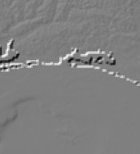

<!-- Improved compatibility of back to top link: See: https://github.com/othneildrew/Best-README-Template/pull/73 -->
<a name="readme-top"></a>
<!--
*** Thanks for checking out the Best-README-Template. If you have a suggestion
*** that would make this better, please fork the repo and create a pull request
*** or simply open an issue with the tag "enhancement".
*** Don't forget to give the project a star!
*** Thanks again! Now go create something AMAZING! :D
-->


<!-- PROJECT SHIELDS -->
<!--
*** I'm using markdown "reference style" links for readability.
*** Reference links are enclosed in brackets [ ] instead of parentheses ( ).
*** See the bottom of this document for the declaration of the reference variables
*** for contributors-url, forks-url, etc. This is an optional, concise syntax you may use.
*** https://www.markdownguide.org/basic-syntax/#reference-style-links
-->
[![Contributors][contributors-shield]][contributors-url]
[![Issues][issues-shield]][issues-url]


<!-- PROJECT LOGO -->
<br />
<div align="center">
  <a href="https://github.com/jwszol-classes/aseied-2022-skierkowski_szarecki">
    
  </a>

<h3 align="center">Measuring System</h3>

  <p align="center">
    Academic project at Gdansk University of Technology
    <br />
    <a href="https://github.com/jwszol-classes/aseied-2022-skierkowski_szarecki"><strong>Explore the docs »</strong></a>
    <br />
    <br />
    ·
    <a href="https://github.com/jwszol-classes/aseied-2022-skierkowski_szarecki/issues/new">Report Bug</a>
    ·
    <a href="https://github.com/jwszol-classes/aseied-2022-skierkowski_szarecki/issues/new">Request Feature</a>
  </p>
</div>


<!-- TABLE OF CONTENTS -->
<details>
  <summary>Table of Contents</summary>
  <ol>
    <li>
      <a href="#about-the-project">About The Project</a>
      <ul>
        <li><a href="#built-with">Built With</a></li>
      </ul>
    </li>
    <li>
      <a href="#getting-started">Getting Started</a>
      <ul>
        <li><a href="#prerequisites">Prerequisites</a></li>
        <li><a href="#installation">Installation</a></li>
      </ul>
    </li>
    <li><a href="#usage">Usage</a></li>
    <li><a href="#roadmap">Roadmap</a></li>
    <li><a href="#contributing">Contributing</a></li>
    <li><a href="#license">License</a></li>
    <li><a href="#contact">Contact</a></li>
    <li><a href="#acknowledgments">Acknowledgments</a></li>
  </ol>
</details>


<!-- ABOUT THE PROJECT -->
## About The Project
### Problem
Analyze the data containing information on elevation variation by selecting groups of areas with the highest growth (continental North and South America). Elevation growth in a given location should be measured from at least 10 measurement points. Determine 6 groups of areas in relation to the average value of height increase. Please plot the detected areas on the map.


<p align="right">(<a href="#readme-top">back to top</a>)</p>

#### Built With

* ![Python3][Python.png]
* ![Pyspark][Pyspark.png]
* ![AWS][AWS.png]

### Technologies
The project site is an AWS cloud environment. 
We defined the following technology requirements on this environment:
* S3 cloud storage - source data ```s3://elevation-tiles-prod/```
* Cluster hardware configuration - m5.xlarge
* Cluster software configuration - JupyterEnterpriseGateway 2.1.0, Spark 2.4.8, Livy 0.7.1
* One node EMR cluster on AWS - EMR 5.36.0
### Dataset
In this project we used terrain-tiles dataset that is available via AWS resources.
It is a global dataset providing bare-earth terrain heights, tiled for easy usage and provided on S3.
Link to source dataset: </br>
[https://registry.opendata.aws/terrain-tiles/](https://registry.opendata.aws/terrain-tiles/)

<p align="right">(<a href="#readme-top">back to top</a>)</p>


---
<!-- GETTING STARTED -->
## Solution
We solved the problem defined in this project using jupyter notebook and PySpark kernel. The main difficulty of this topic was to count the speed of growth. We used a gradient for this. 
Below we will present the more important parts of the code.
### Installed python packages on PySpark Kernel
```Package                    Version
-------------------------- ----------
aws-cfn-bootstrap          2.0
beautifulsoup4             4.9.3
boto                       2.49.0
click                      8.1.1
cycler                     0.11.0
docutils                   0.14
fonttools                  4.37.1
jmespath                   1.0.0
joblib                     1.1.0
kiwisolver                 1.4.4
lockfile                   0.11.0
lxml                       4.8.0
matplotlib                 3.5.3
mysqlclient                1.4.2
nltk                       3.7
nose                       1.3.4
numpy                      1.20.0
opencv-python              4.6.0.66
packaging                  21.3
Pillow                     9.2.0
pip                        22.2.2
py-dateutil                2.2
pyparsing                  3.0.9
pystache                   0.5.4
python-daemon              2.2.3
python-dateutil            2.8.2
python37-sagemaker-pyspark 1.4.1
pytz                       2022.1
PyYAML                     5.4.1
regex                      2021.11.10
setuptools                 28.8.0
simplejson                 3.2.0
six                        1.13.0
tqdm                       4.63.1
typing_extensions          4.3.0
wheel                      0.29.0
windmill                   1.6
```

### Steps with code example:
1. Getting dataset

* `tiles_url()` function  creates a list of all the tiles needed to be downloaded based on 2 longitude values and 2 latitude values
* `load()` spark method creates PySpark Dataframe with all downloaded tiles

  ```sh
    AMERICA = (74, -174, 8, -40)
    
    data, x_interval, y_interval = tiles_url(5, *AMERICA)
    input_data = spark.read.format("image").load(data)
  ```
2. Adding an index column built on x and y values to sort the data
* `to_idx()` function takes x value from image.origin column which contains the paths to the tiles

    ```angular2html
    ...
    input_data2 = input_data2.withColumn("idx", new_idx("origin"))
    input_data2 = input_data2.withColumn("idy", new_idy("origin"))
    input_data2 = input_data2.orderBy(col("idx").asc(), col("idy").asc())
    ```
3. Calculating height in all tiles
* `.rdd` converts PySpark Dataframe to RDD. It enables several needed  transformations.
* `get_height()` function counts height using BGR values. The function used this equation: 

    ```angular2html
    images = images.rdd.map(lambda img: np.reshape(img, (256,256,3))) #images<dateframe> to images<rdd>
    images = images.map(get_height)

    ```
4. Getting gradient with OpenCV
* `gx` computed horizontal change 
* `gy` computed vertical change 
* `combined` it's gradient magnitude, used to measure how strong the change in image intensity is.

    ```angular2html
    gX = images.map(lambda img: cv2.Sobel(img, cv2.CV_64F, 1, 0))
    gY = images.map(lambda img: cv2.Sobel(img, cv2.CV_64F, 0, 1))
    ...
    combined = np.sqrt(gx**2 + gy**2)
    ```
5. Determining of 6 groups of areas in relation to the average value of height increase
* `create_groups()` function calculates the average for each tile and sorts these values ascendingly. On this basis, it determines 6 groups.

    ```angular2html
       groups = create_groups(combined)
    ```
6. Coloring tiles
* `paint()` function process tiles in rdd and colors tiles according to its group membership

    ```angular2html
    painted = paint(combined, groups)
    ```
7. Combining tiles into one map and plotting image
* `plot_map()` function concatenates tiles to one big map represented as numpy nd.array

   ```angular2html
     plot_map(painted, x_interval, y_interval)
    ```


### Installation

1. Clone the repo
   ```sh
   git clone https://github.com/jwszol-classes/aseied-2022-skierkowski_szarecki.git
   ```
2. Create account on www.awseducate.com 
3. Create cluster with defined technology requirements in Technology
4. Create notebook and open in jupyterlab
5. Upload `.ipynb file` from our repository
6. Run uploaded notebook on PySpark Kernel

<p align="right">(<a href="#readme-top">back to top</a>)</p>

---

## Results

Use this space to show useful examples of how a project can be used. Additional screenshots, code examples and demos work well in this space. You may also link to more resources.

_For more examples, please refer to the [Documentation](https://example.com)_

<p align="right">(<a href="#readme-top">back to top</a>)</p>


---
<!-- ROADMAP -->
## Roadmap

- [x] Downloading dataset from bucket & Creating PySpark Dataframe
- [x] Sorting tiles in Dataframe
- [x] Calculating height of downloaded tiles
- [x] Calculating gradient for each tile
- [x] Grouping tiles for 6 height growth groups 
- [x] Combination of all tiles
- [x] Coloring and presenting North and South America

See the [open issues](https://github.com/jwszol-classes/aseied-2022-skierkowski_szarecki/issues) for a full list of proposed features (and known issues).

<p align="right">(<a href="#readme-top">back to top</a>)</p>

<!-- LICENSE -->
## License

Distributed under the MIT License. See `LICENSE.txt` for more information.

<p align="right">(<a href="#readme-top">back to top</a>)</p>

<!-- CONTACT -->
## Contact

Names:
* Lukasz Szarecki
* Marcel Skierkowski

Project Link: [https://github.com/jwszol-classes/aseied-2022-skierkowski_szarecki](https://github.com/jwszol-classes/aseied-2022-skierkowski_szarecki)

<p align="right">(<a href="#readme-top">back to top</a>)</p>


<!-- Links -->
## Links

* https://spark.apache.org/docs/latest/api/python/reference/ 
* https://sparkbyexamples.com/pyspark/


<p align="right">(<a href="#readme-top">back to top</a>)</p>


<!-- MARKDOWN LINKS & IMAGES -->
<!-- https://www.markdownguide.org/basic-syntax/#reference-style-links -->
[contributors-shield]: https://img.shields.io/github/contributors/jwszol-classes/aseied-2022-skierkowski_szarecki.svg?style=for-the-badge
[contributors-url]: https://github.com/jwszol-classes/aseied-2022-skierkowski_szarecki/graphs/contributors
[forks-shield]: https://img.shields.io/github/forks/jwszol-classes/aseied-2022-skierkowski_szarecki.svg?style=for-the-badge
[stars-shield]: https://img.shields.io/github/stars/jwszol-classes/aseied-2022-skierkowski_szarecki.svg?style=for-the-badge
[stars-url]: https://github.com/jwszol-classes/aseied-2022-skierkowski_szarecki/stargazers
[issues-shield]: https://img.shields.io/github/issues/jwszol-classes/aseied-2022-skierkowski_szarecki.svg?style=for-the-badge
[issues-url]: https://github.com/jwszol-classes/aseied-2022-skierkowski_szarecki/issues
[license-shield]: https://img.shields.io/github/license/jwszol-classes/aseied-2022-skierkowski_szarecki.svg?style=for-the-badge
[license-url]: https://github.com/jwszol-classes/aseied-2022-skierkowski_szarecki/blob/master/LICENSE.txt
[linkedin-shield]: https://img.shields.io/badge/-LinkedIn-black.svg?style=for-the-badge&logo=linkedin&colorB=555
[linkedin-url]: https://linkedin.com/in/linkedin_username
[product-screenshot]: images/screenshot.png
[Python.png]: https://www.python.org/static/community_logos/python-powered-w-100x40.png
[Pyspark.png]: images/pyspark.png
[AWS.png]: images/aws.png
